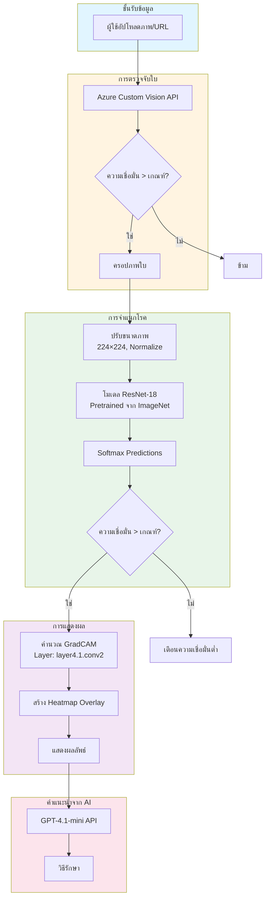
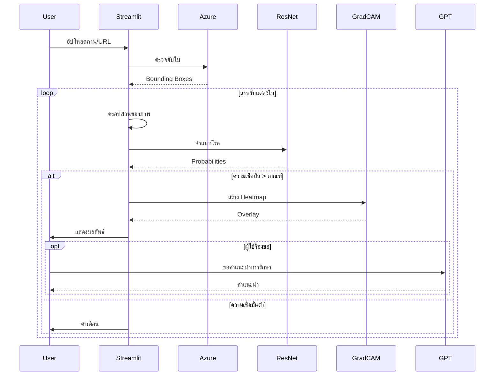

# เอกสารโครงการจำแนกโรคใบข้าวโพด

**ภาพรวมโครงการ:** ระบบ Deep Learning สำหรับจำแนกโรคใบข้าวโพดโดยใช้สถาปัตยกรรม ResNet พร้อม GradCAM visualization และอินเทอร์เฟซเว็บ

**อัปเดตล่าสุด:** 9 ธันวาคม 2568

**GitHub Repository:** https://github.com/panthakan-fusionsol/Intelligent-AgriDiagnose/

---

## สารบัญ

1. [ภาพรวมโครงการ](#ภาพรวมโครงการ)
2. [สถาปัตยกรรมระบบ](#สถาปัตยกรรมระบบ)
3. [การเทรนโมเดล](#การเทรนโมเดล)
4. [GradCAM Visualization](#gradcam-visualization)
5. [การเลือก Confidence Threshold](#การเลือก-confidence-threshold)
6. [อินเทอร์เฟซเว็บ](#อินเทอร์เฟซเว็บ)
7. [โครงสร้างข้อมูล](#โครงสร้างข้อมูล)
8. [คู่มือเริ่มต้นใช้งาน](#คู่มือเริ่มต้นใช้งาน)

---

## 1. ภาพรวมโครงการ

โครงการนี้พัฒนา pipeline สำหรับตรวจจับและจำแนกโรคใบข้าวโพดด้วย Deep Learning (ResNet-18/50) ประกอบด้วย:

- **Training Pipeline**: Transfer learning ด้วย ResNet architecture
- **Visualization**: GradCAM heatmaps เพื่ออธิบายการทำงานของโมเดล
- **Threshold Optimization**: การเลือก confidence threshold อัตโนมัติ
- **Web Interface**: แอปพลิเคชัน Streamlit พร้อมรองรับหลายภาษา
- **Integration**: Azure Custom Vision API สำหรับตรวจจับใบ

### โรคที่รองรับ (10 ชนิด)

| รหัสโรค | ชื่อโรค | คำอธิบาย |
|---------|---------|----------|
| abnormality | Herbicide Injury | ความเสียหายจากสารเคมี |
| blight | Northern Corn Leaf Blight | โรคราทำให้เกิดแผลบนใบ |
| brownspot | Brown Spot | โรคราจุดสีน้ำตาล |
| curl | Twisted Whorl | ใบบิดเบี้ยว |
| healthy | Healthy | สุขภาพดี ไม่มีโรค |
| mildew | Downy Mildew | โรคราน้ำค้าง |
| rust | Rust | สนิมใบข้าวโพด (จุดสีส้ม-น้ำตาล) |
| smut | Smut | โรคถ่านดำ |
| spot | Leaf Sheath and Leaf Spot | โรคจุดใบและกาบใบ |
| virus | Virus | โรคไวรัสต่างๆ |

---

## 2. สถาปัตยกรรมระบบ



### Training Pipeline

```mermaid
flowchart LR
    subgraph Data["การเตรียมข้อมูล"]
        A1[ภาพต้นฉบับ] --> A2[ปรับขนาด 224×224]
        A2 --> A3[Data Augmentation<br/>Flip, Rotate, Affine]
        A3 --> A4[Normalize<br/>ImageNet Stats]
    end
    
    subgraph Model["การเทรนโมเดล"]
        B1[ResNet-18/50<br/>น้ำหนักเริ่มต้น]
        B2[เปลี่ยน FC Layer<br/>10 Classes]
        B3[Adam Optimizer<br/>LR: 0.001]
        B4[CrossEntropyLoss]
        B5[StepLR/Cosine Scheduler]
    end
    
    subgraph Validation["Validation & Saving"]
        C1[Validate แต่ละ Epoch]
        C2{Accuracy ดีสุด?}
        C3[บันทึก Checkpoint]
        C4[สร้าง Metrics<br/>Confusion Matrix, Report]
    end
    
    A4 --> B1
    B1 --> B2
    B2 --> B3
    B3 --> B4
    B4 --> B5
    B5 --> C1
    C1 --> C2
    C2 -->|ใช่| C3
    C2 -->|ไม่| B3
    C3 --> C4
    
    style Data fill:#e3f2fd
    style Model fill:#f1f8e9
    style Validation fill:#fff3e0
```



---

## 3. การเทรนโมเดล

### 3.1 ไฟล์หลัก

| ไฟล์ | วัตถุประสงค์ |
|------|--------------|
| `train.py` | สคริปต์เทรนหลักพร้อมการตั้งค่า hyperparameter |
| `model.py` | สถาปัตยกรรมโมเดล (ResNet-18/34/50/101, EfficientNet) |
| `corn_dataset.py` | Dataset class และการโหลดข้อมูล |
| `utils.py` | ฟังก์ชันช่วยสำหรับ visualization และ evaluation |

### 3.2 Hyperparameters

#### การตั้งค่าเริ่มต้น

```python
# การประมวลผลภาพ
IMAGE_SIZE = 224          # ขนาดภาพ input (224×224)
BATCH_SIZE = 32           # ขนาด batch สำหรับเทรน
NUM_WORKERS = 0           # จำนวน workers ของ DataLoader

# Optimization
LEARNING_RATE = 0.001     # Learning rate เริ่มต้น
WEIGHT_DECAY = 1e-4       # L2 regularization
NUM_EPOCHS = 25           # จำนวน epochs
OPTIMIZER = "Adam"        # อัลกอริทึม optimization

# Scheduler Options
SCHEDULER = "step"        # ตัวเลือก: "step", "cosine", "none"
# StepLR: step_size=7, gamma=0.1
# CosineAnnealingLR: T_max=num_epochs, eta_min=3e-6

# Model
ARCHITECTURE = "resnet18" # ตัวเลือก: resnet18, resnet50, effnetv2
PRETRAINED = True         # ใช้น้ำหนักจาก ImageNet

# Augmentation
JITTER = False           # เปิด ColorJitter augmentation
RMBG = False             # เปิดโหมดลบพื้นหลัง
```

#### กลยุทธ์ Augmentation

**Training Transforms (มี ColorJitter):**
```python
transforms.Compose([
    transforms.Resize((224, 224), interpolation=BILINEAR),
    transforms.CenterCrop((224, 224)),
    transforms.RandomHorizontalFlip(p=0.5),
    transforms.RandomVerticalFlip(p=0.5),
    transforms.RandomAffine(degrees=0, translate=(0.1, 0.1), scale=(0.9, 1.1)),
    transforms.RandomRotation(degrees=45),
    transforms.ColorJitter(brightness=0.4, contrast=0.4, saturation=0.4, hue=0.4),
    transforms.ToTensor(),
    transforms.Normalize(mean=[0.485, 0.456, 0.406], std=[0.229, 0.224, 0.225])
])
```

**Training Transforms (ไม่มี ColorJitter):**
```python
transforms.Compose([
    transforms.Resize((224, 224)),
    transforms.CenterCrop((224, 224)),
    transforms.RandomHorizontalFlip(p=0.5),
    transforms.RandomVerticalFlip(p=0.5),
    transforms.RandomAffine(degrees=0, translate=(0.1, 0.1), scale=(0.9, 1.1)),
    transforms.RandomRotation(degrees=90),
    transforms.ToTensor(),
    transforms.Normalize(mean=[0.485, 0.456, 0.406], std=[0.229, 0.224, 0.225])
])
```

**Validation/Test Transforms:**
```python
transforms.Compose([
    transforms.Resize((224, 224)),
    transforms.ToTensor(),
    transforms.Normalize(mean=[0.485, 0.456, 0.406], std=[0.229, 0.224, 0.225])
])
```

### 3.3 สถาปัตยกรรมโมเดล

#### ResNet-18 (ค่าเริ่มต้น)
```python
def create_resnet18_model(num_classes, pretrained=True):
    model = models.resnet18(pretrained=pretrained)
    num_features = model.fc.in_features  # 512
    model.fc = nn.Linear(num_features, num_classes)
    return model
```

**รายละเอียดสถาปัตยกรรม:**
- **Input**: ภาพ RGB 3×224×224
- **Backbone**: ResNet-18 (pretrained บน ImageNet)
- **มิติ Feature**: 512
- **Output**: 10 classes (โรคข้าวโพด)
- **Parameters**: ~11.7M

#### ResNet-50
```python
def create_resnet50_model(num_classes, pretrained=True):
    model = models.resnet50(pretrained=pretrained)
    num_features = model.fc.in_features  # 2048
    model.fc = nn.Linear(num_features, num_classes)
    return model
```

**รายละเอียดสถาปัตยกรรม:**
- **มิติ Feature**: 2048
- **Parameters**: ~25.6M

#### EfficientNet-V2-S
```python
def create_effnetv2_model(num_classes, pretrained=True):
    weights = models.EfficientNet_V2_S_Weights.IMAGENET1K_V1 if pretrained else None
    model = models.efficientnet_v2_s(weights=weights)
    num_features = model.classifier[1].in_features
    model.classifier[1] = nn.Linear(num_features, num_classes)
    return model
```

### 3.4 กระบวนการเทรน

#### Loss Function
```python
criterion = nn.CrossEntropyLoss()
```

#### การตั้งค่า Optimizer
```python
optimizer = optim.Adam(
    model.parameters(),
    lr=args.lr,           # 0.001
    weight_decay=1e-4     # L2 regularization
)
```

#### Learning Rate Schedulers

**ตัวเลือก 1: StepLR**
```python
scheduler = optim.lr_scheduler.StepLR(
    optimizer,
    step_size=7,    # ลดค่าทุก 7 epochs
    gamma=0.1       # คูณ LR ด้วย 0.1
)
```

**ตัวเลือก 2: CosineAnnealingLR**
```python
scheduler = CosineAnnealingLR(
    optimizer,
    T_max=args.num_epochs,  # 25
    eta_min=3e-6            # Learning rate ต่ำสุด
)
```

#### Training Loop
```python
for epoch in range(num_epochs):
    # Training phase
    model.train()
    for images, labels in tqdm(train_loader):
        outputs = model(images)
        loss = criterion(outputs, labels)
        
        optimizer.zero_grad()
        loss.backward()
        optimizer.step()
    
    # Validation phase
    model.eval()
    with torch.no_grad():
        for images, labels in val_loader:
            outputs = model(images)
            # คำนวณ accuracy
    
    # อัปเดต learning rate
    scheduler.step()
    
    # บันทึกโมเดลที่ดีสุด
    if val_acc > best_acc:
        save_checkpoint(model, optimizer, epoch, val_acc)
```

### 3.5 ผลลัพธ์ที่ได้

การเทรนจะสร้างผลลัพธ์ใน `model_training/{run_name}/`:

```
model_training/resnet18_224_cosine_croponly_10/
├── checkpoints/
│   └── best.pth                    # น้ำหนักโมเดลที่ดีสุด
├── logs/
│   └── events.out.tfevents.*      # TensorBoard logs
├── training_curves.png             # กราฟ Loss และ accuracy
├── confusion_matrix.png            # Confusion matrix heatmap
└── classification_report.txt       # Precision, recall, F1-score
```

#### รูปแบบ Checkpoint
```python
{
    "model_state_dict": model.state_dict(),
    "class_names": ["rust", "blight", "spot", ...],
    "class_to_idx": {"rust": 0, "blight": 1, ...},
    "num_classes": 10,
    "architecture": "resnet18",
    "timestamp": "2025-12-09_14:30:00",
    "training_info": {
        "epochs": 25,
        "best_val_acc": 0.95,
        "hyperparameters": {...}
    }
}
```

---

## 4. GradCAM Visualization

### 4.1 ไฟล์หลัก

| ไฟล์ | วัตถุประสงค์ |
|------|--------------|
| `simple_gradcam.py` | การทำ GradCAM และ CLI tool |
| `video_gradcam.py` | GradCAM สำหรับวิดีโอ |

### 4.2 ภาพรวมอัลกอริทึม

**Gradient-weighted Class Activation Mapping (Grad-CAM)** แสดง Visualization บริเวณของภาพที่สำคัญต่อการทำนายของโมเดล

#### สูตรทางคณิตศาสตร์

1. **Forward Pass**: รับ feature maps $A^k$ และ predictions $y^c$
2. **Backward Pass**: คำนวณ gradients $\frac{\partial y^c}{\partial A^k}$
3. **Global Average Pooling**: $\alpha_k^c = \frac{1}{Z} \sum_i \sum_j \frac{\partial y^c}{\partial A_{ij}^k}$
4. **Weighted Combination**: $L_{Grad-CAM}^c = ReLU(\sum_k \alpha_k^c A^k)$
5. **Normalization**: ปรับขนาดเป็น [0, 1]

#### การทำงาน

```python
def compute_gradcam(model: nn.Module, image_tensor: torch.Tensor, layer_name: str):
    """
    คำนวณ GradCAM heatmap สำหรับ layer ที่กำหนด
    
    Args:
        model: PyTorch model
        image_tensor: Input tensor [B, C, H, W]
        layer_name: Target layer (เช่น "layer4.1.conv2")
    
    Returns:
        cam: GradCAM heatmap [B, H', W']
    """
    # พื้นที่เก็บ activations และ gradients
    feats = []
    grads = []
    
    # Hook functions
    def forward_hook(module, input, output):
        feats.append(output.detach())
    
    def backward_hook(module, grad_in, grad_out):
        grads.append(grad_out[0].detach())
    
    # หา target layer
    layer = dict(model.named_modules())[layer_name]
    
    # ลงทะเบียน hooks
    h1 = layer.register_forward_hook(forward_hook)
    h2 = layer.register_full_backward_hook(backward_hook)
    
    try:
        # Forward pass
        model.zero_grad()
        preds = model(image_tensor)
        class_id = preds.softmax(dim=-1).argmax(dim=-1)
        score = preds.gather(1, class_id.view(-1, 1)).sum()
        
        # Backward pass
        score.backward()
        
        # คำนวณ weighted combination
        weights = grads[0].mean(dim=(-2, -1), keepdim=True)  # [B, C, 1, 1]
        cam = (weights * feats[0]).sum(dim=1)                 # [B, H', W']
        cam = torch.relu(cam)                                  # ReLU
        
        # Normalize
        cam_max = cam.view(cam.size(0), -1).max(dim=1)[0]
        cam_max = cam_max.view(-1, 1, 1)
        cam = cam / (cam_max + 1e-8)
        
        return cam.detach().cpu().numpy()
    finally:
        h1.remove()
        h2.remove()
```

### 4.3 Target Layers

| โมเดล | ชื่อ Layer | ประเภท Block |
|-------|------------|--------------|
| ResNet-18 | `layer4.1.conv2` | BasicBlock (conv สุดท้าย) |
| ResNet-34 | `layer4.2.conv2` | BasicBlock (conv สุดท้าย) |
| ResNet-50 | `layer4.2.conv3` | Bottleneck (conv สุดท้าย) |
| ResNet-101 | `layer4.2.conv3` | Bottleneck (conv สุดท้าย) |

### 4.4 Heatmap Overlay

```python
def overlay_gradcam(original_image, cropped_image, heatmap, 
                   alpha=0.4, crop_coords=None):
    """
    ซ้อน GradCAM heatmap บนภาพต้นฉบับ
    
    Args:
        original_image: PIL Image (ต้นฉบับ)
        cropped_image: PIL Image (ส่วนที่ครอป)
        heatmap: numpy array [H, W] ในช่วง [0, 1]
        alpha: ค่าการผสม
        crop_coords: (x1, y1, x2, y2) พิกัดครอป
    
    Returns:
        blended: PIL Image พร้อม heatmap overlay
    """
    # ปรับขนาด heatmap ให้ตรงกับส่วนที่ครอป
    crop_w = crop_coords[2] - crop_coords[0]
    crop_h = crop_coords[3] - crop_coords[1]
    heatmap_resized = cv2.resize(heatmap, (crop_w, crop_h))
    
    # สร้าง heatmap ขนาดเต็ม
    full_heatmap = np.zeros(original_image.size[::-1], dtype=np.float32)
    full_heatmap[crop_coords[1]:crop_coords[3], 
                 crop_coords[0]:crop_coords[2]] = heatmap_resized
    
    # ใช้ colormap (JET: น้ำเงิน → ฟ้า → เหลือง → แดง)
    heatmap_u8 = np.uint8(255 * full_heatmap)
    heatmap_color = cv2.applyColorMap(heatmap_u8, cv2.COLORMAP_JET)
    heatmap_color = cv2.cvtColor(heatmap_color, cv2.COLOR_BGR2RGB)
    
    # ผสมกับภาพต้นฉบับ
    orig_np = np.array(original_image)
    blended = cv2.addWeighted(orig_np, 1 - alpha, heatmap_color, alpha, 0)
    
    return Image.fromarray(blended)
```

### 4.5 การตีความ Colormap

Colormap แบบ JET แสดงความเข้มของการ activation:

- **น้ำเงิน**: activation ต่ำ (ไม่สำคัญต่อการทำนาย)
- **ฟ้า/เขียว**: activation ปานกลาง
- **เหลือง**: activation สูง
- **แดง**: activation สูงมาก (บริเวณที่สำคัญที่สุด)

---

## 5. การเลือก Confidence Threshold

### 5.1 ไฟล์หลัก

| ไฟล์ | วัตถุประสงค์ |
|------|--------------|
| `conf_thresh.py` | สคริปต์เลือก threshold อัตโนมัติ |

### 5.2 แรงจูงใจ

**ปัญหา**: โมเดลให้ output เป็น probability distribution แต่เราต้องมี threshold เพื่อตัดสินใจว่า:
- เมื่อไรควรเชื่อการทำนาย (ความเชื่อมั่นสูง)
- เมื่อไรควรปฏิเสธการทำนาย (ความเชื่อมั่นต่ำ)

**เป้าหมาย**: หา threshold ที่เหมาะสมซึ่งสมดุลระหว่าง:
- **Accuracy**: การทำนายที่ถูกต้องในตัวอย่างที่ยอมรับ
- **Coverage**: เปอร์เซ็นต์ของตัวอย่างที่ยอมรับ

### 5.3 อัลกอริทึม

```python
def sweep_confidence_thresholds(model, dataloader, class_names, 
                                threshold_step=0.025):
    """
    สแกน confidence thresholds จาก 0 ถึง 1
    
    Returns:
        thresholds: รายการค่า threshold
        accuracies: Accuracy ที่แต่ละ threshold
        coverages: Coverage ที่แต่ละ threshold
    """
    # รับการทำนายทั้งหมด
    all_preds = []
    all_labels = []
    all_probs = []
    
    model.eval()
    with torch.no_grad():
        for images, labels in dataloader:
            outputs = model(images)
            probs = F.softmax(outputs, dim=1)
            max_probs, preds = probs.max(dim=1)
            
            all_preds.extend(preds.cpu().numpy())
            all_labels.extend(labels.cpu().numpy())
            all_probs.extend(max_probs.cpu().numpy())
    
    all_preds = np.array(all_preds)
    all_labels = np.array(all_labels)
    all_probs = np.array(all_probs)
    
    # สแกน thresholds
    thresholds = np.arange(0, 1 + threshold_step, threshold_step)
    accuracies = []
    coverages = []
    
    for thresh in thresholds:
        # กรองตาม confidence
        mask = all_probs >= thresh
        
        if mask.sum() > 0:
            acc = (all_preds[mask] == all_labels[mask]).mean()
            cov = mask.mean()
        else:
            acc = 0.0
            cov = 0.0
        
        accuracies.append(acc)
        coverages.append(cov)
    
    return thresholds, accuracies, coverages
```

### 5.4 การหา Optimal Threshold

#### วิธีที่ 1: จุดตัดกัน
หาจุดที่เส้น accuracy และ coverage ตัดกัน

```python
def find_intersection_x(x, y1, y2):
    """
    หาพิกัด x ที่เส้นสองเส้นตัดกัน
    
    Args:
        x: ค่า X (thresholds)
        y1: ค่า Y สำหรับเส้นที่ 1 (accuracy)
        y2: ค่า Y สำหรับเส้นที่ 2 (coverage)
    
    Returns:
        xi: พิกัด X ของจุดตัด
    """
    d = y1 - y2
    s = np.sign(d)
    
    # หาจุดที่เครื่องหมายเปลี่ยน
    idx = np.where((s[:-1] == 0) | (s[:-1] * s[1:] < 0) | (s[1:] == 0))[0]
    
    if len(idx) == 0:
        return None
    
    # Linear interpolation
    i = idx[0]
    x0, x1 = x[i], x[i+1]
    d0, d1 = d[i], d[i+1]
    
    if d1 == d0:
        return x0
    
    t = -d0 / (d1 - d0)
    xi = x0 + t * (x1 - x0)
    
    return xi
```

#### วิธีที่ 2: Target Coverage
หา threshold ที่ให้ coverage ตามที่ต้องการ (เช่น 80%)

```python
def find_threshold_for_coverage(thresholds, coverages, target_coverage=0.8):
    """
    หา threshold ที่ใกล้เคียง target coverage
    
    Args:
        thresholds: Array ของ thresholds
        coverages: Array ของ coverages
        target_coverage: Coverage ที่ต้องการ (0-1)
    
    Returns:
        best_threshold: Threshold ที่ให้ target coverage
    """
    idx = np.argmin(np.abs(np.array(coverages) - target_coverage))
    return thresholds[idx]
```

### 5.5 Visualization

สคริปต์สร้างกราฟ 3 รูป:

1. **Accuracy vs Confidence**
   - แสดงการเปลี่ยนแปลง accuracy ตาม threshold
   - Threshold สูง → ตัวอย่างน้อย → accuracy สูง

2. **Coverage vs Confidence**
   - แสดงเปอร์เซ็นต์ตัวอย่างที่ยอมรับ
   - Threshold สูง → coverage ต่ำ

3. **Combined Plot**
   - ทั้งสองเส้นในกราฟเดียวกัน
   - จุดตัดกันถูกทำเครื่องหมาย
   - Optimal threshold ถูก highlight

### 5.6 ผลลัพธ์

```
Optimal Thresholds:
- Intersection Point: 0.875 (Accuracy: 0.95, Coverage: 0.85)
- For 80% Coverage: 0.825 (Accuracy: 0.93, Coverage: 0.80)
- For 90% Coverage: 0.750 (Accuracy: 0.91, Coverage: 0.90)
```

---

## 6. อินเทอร์เฟซเว็บ

### 6.1 ไฟล์หลัก

| ไฟล์ | วัตถุประสงค์ |
|------|--------------|
| `web_asean_latest.py` | แอปพลิเคชัน Streamlit (เวอร์ชันล่าสุด) |
| `languages.py` | รองรับหลายภาษา (EN, TH, และภาษาอาเซียน) |

### 6.2 ฟีเจอร์

#### รองรับหลายภาษา
- **อังกฤษ**: ภาษาเริ่มต้น
- **ไทย**: ภาษาไทย
- **เวียดนาม**: Tiếng Việt
- **อินโดนีเซีย**: Bahasa Indonesia
- **มาเลย์**: Bahasa Melayu
- **ตากาล็อก**: Tagalog
- **เขมร**: ភាសាខ្មែរ
- **ลาว**: ພາສາລາວ
- **พม่า**: မြန်မာဘာသာ

#### วิธีการ Input

**1. Image URL**
```python
url = st.text_input("ใส่ URL ของภาพ:")
if url:
    image = load_image_from_url(url)
```

**2. File Upload**
```python
uploaded_file = st.file_uploader("อัปโหลดภาพ:", type=['jpg', 'jpeg', 'png'])
if uploaded_file:
    image = Image.open(uploaded_file)
```

#### โหมดการตรวจจับ

**1. การตรวจจับอัตโนมัติ (Azure Custom Vision)**
```python
# เรียก Azure API
response = requests.post(
    endpoint_url,
    headers={'Prediction-Key': prediction_key, 'Content-Type': 'application/json'},
    json={'Url': image_url}
)

# กรองตามความเชื่อมั่น
predictions = response.json()['predictions']
valid_boxes = [p for p in predictions if p['probability'] >= detect_conf_threshold]
```

**2. ครอปด้วยมือ (Streamlit Cropper)**
```python
cropped_img = st_cropper(
    image,
    realtime_update=True,
    box_color='#0000FF',
    aspect_ratio=None
)
```

### 6.3 Pipeline



### 6.4 การตั้งค่าโมเดล

```python
# เส้นทางโมเดล
MODEL_PATH = "model_training/resnet18_224_cosine_croponly_10_jitter/checkpoints/best.pth"
ARCHITECTURE = "resnet18"
IMG_SIZE = 224

# โหลดโมเดล
checkpoint = torch.load(MODEL_PATH, map_location=device)
model = create_resnet18_model(num_classes=10)
model.load_state_dict(checkpoint['model_state_dict'])
model.eval()

# Class mapping
class_names = checkpoint['class_names']
class2id = checkpoint['class_to_idx']
```

### 6.5 Confidence Thresholds

ผู้ใช้สามารถปรับ threshold ทั้งสองค่าผ่าน slider:

**1. Leaf Detection Confidence**
```python
detect_conf_threshold = st.slider(
    "ความเชื่อมั่นการตรวจจับใบ:",
    min_value=0.50,
    max_value=0.99,
    value=0.95,
    step=0.01
)
```

**2. Disease Classification Confidence**
```python
disease_conf_threshold = st.slider(
    "ความเชื่อมั่นการจำแนกโรค:",
    min_value=0.0,
    max_value=0.99,
    value=0.975,
    step=0.001
)
```

### 6.6 การรวม GradCAM

```python
# Toggle GradCAM สำหรับแต่ละใบ
show_gradcam = st.checkbox(f"แสดง GradCAM สำหรับใบที่ {i+1}", value=False)

if show_gradcam:
    # คำนวณ heatmap
    heatmap = compute_gradcam(model, crop_tensor, "layer4.1.conv2")
    
    # ซ้อนบนภาพต้นฉบับ
    overlay_img = overlay_gradcam(
        original_image=image,
        cropped_image=crop_pil,
        heatmap=heatmap[0],
        alpha=0.5,
        crop_coords=(x1, y1, x2, y2)
    )
    
    st.image(overlay_img, caption="GradCAM Heatmap")
```

### 6.7 การรวม GPT

```python
# การตั้งค่า OpenAI Azure
openai_client = OpenAI(
    base_url="https://chat-gpt-corn.openai.azure.com/openai/v1/",
    api_key=os.getenv('chat-gpt-api-key')
)

# รับคำแนะนำการรักษา
def get_treatment_advice(disease_name, language='en'):
    prompt = f"ให้คำแนะนำการรักษา {disease_name} ในพืชข้าวโพด"
    
    response = openai_client.chat.completions.create(
        model="gpt-4.1-mini",
        messages=[
            {"role": "system", "content": "คุณเป็นผู้เชี่ยวชาญด้านการเกษตร"},
            {"role": "user", "content": prompt}
        ],
        temperature=0.7,
        max_tokens=500
    )
    
    return response.choices[0].message.content
```

### 6.8 ฟีเจอร์ UI/UX

#### การออกแบบแบบ Mobile-Responsive
```css
@media (max-width: 768px) {
    .stApp {
        padding: 1rem;
    }
    
    .element-container {
        width: 100% !important;
    }
}
```

#### การจัดการ Session State
```python
# เก็บข้อมูลข้าม interactions
if 'image_data' not in st.session_state:
    st.session_state.image_data = None

if 'predictions' not in st.session_state:
    st.session_state.predictions = {}

if 'gpt_responses' not in st.session_state:
    st.session_state.gpt_responses = {}
```

#### ตัวบ่งชี้ความคืบหน้า
```python
with st.spinner('กำลังตรวจจับใบ...'):
    boxes = detect_leaves(image)

with st.spinner('กำลังจำแนกโรค...'):
    predictions = classify_crops(boxes)
```

---

## 7. โครงสร้างข้อมูล

### 7.1 โครงสร้างไดเรกทอรี

```
All_Crops/
├── train/
│   ├── rust_train/           # 1000+ ภาพ
│   ├── blight_train/
│   ├── spot_train/
│   ├── virus_train/
│   ├── mildew_train/
│   ├── healthy_train/
│   ├── brownspot_train/
│   ├── curl_train/
│   ├── smut_train/
│   └── abnormality_train/
├── validation/
│   ├── rust_val/             # 200+ ภาพต่อ class
│   ├── blight_val/
│   └── ...
└── test/
    ├── rust_test/            # 200+ ภาพต่อ class
    ├── blight_test/
    └── ...
```

### 7.2 รูปแบบไฟล์ที่รองรับ

- `.jpg`, `.jpeg`
- `.png`
- `.bmp`
- `.tif`, `.tiff`
- `.webp`

### 7.3 การโหลดข้อมูล

```python
from corn_dataset import make_dataloaders

# สร้าง dataloaders
train_dl, val_dl, class2id = make_dataloaders(
    train_path="All_Crops/train",
    val_path="All_Crops/validation",
    selected_classes="rust,blight,spot,virus,mildew,healthy",
    img_size=224,
    batch_size=32,
    num_workers=0,
    jitter=False,
    rmbg=False
)
```

### 7.4 การกรอง Class

คุณสามารถเทรนบน subset ของ classes:

```bash
# เทรน 6 classes เท่านั้น
python train.py --selected_classes "rust,blight,spot,virus,mildew,healthy"

# เทรนทั้งหมด 10 classes
python train.py --selected_classes "rust,blight,spot,virus,mildew,healthy,brownspot,curl,smut,abnormality"
```

---

## 8. คู่มือเริ่มต้นใช้งาน

### 8.1 การติดตั้ง

```bash
# Clone repository
cd /path/to/corn_project

# สร้าง virtual environment
python -m venv venv
source venv/bin/activate  # Windows: venv\Scripts\activate

# ติดตั้ง dependencies
pip install -r requirements.txt
```

**Dependencies หลัก:**
```txt
torch>=2.0.0
torchvision>=0.15.0
streamlit>=1.28.0
opencv-python>=4.8.0
pillow>=10.0.0
numpy>=1.24.0
matplotlib>=3.7.0
seaborn>=0.12.0
scikit-learn>=1.3.0
tqdm>=4.65.0
tensorboard>=2.13.0
openai>=1.3.0
streamlit-cropper>=0.2.0
```

### 8.2 การเทรนโมเดล

#### การเทรนพื้นฐาน

```bash
python train.py \
    --img_size 224 \
    --batch_size 32 \
    --lr 0.001 \
    --num_epochs 25 \
    --architecture resnet18 \
    --scheduler cosine \
    --selected_classes "rust,blight,spot,virus,mildew,healthy"
```

#### การเทรนพร้อม ColorJitter Augmentation

```bash
python train.py \
    --img_size 224 \
    --batch_size 32 \
    --lr 0.001 \
    --num_epochs 25 \
    --architecture resnet18 \
    --scheduler cosine \
    --jitter \
    --selected_classes "rust,blight,spot,virus,mildew,healthy"
```

#### การเทรนพร้อมการลบพื้นหลัง

```bash
python train.py \
    --img_size 224 \
    --batch_size 32 \
    --lr 0.001 \
    --num_epochs 25 \
    --architecture resnet18 \
    --scheduler step \
    --rmbg \
    --selected_classes "rust,blight,spot,virus,mildew,healthy"
```

#### การเทรน ResNet-50

```bash
python train.py \
    --img_size 224 \
    --batch_size 16 \
    --lr 0.001 \
    --num_epochs 25 \
    --architecture resnet50 \
    --scheduler cosine \
    --selected_classes "rust,blight,spot,virus,mildew,healthy"
```

#### การเทรน EfficientNet-V2

```bash
python train.py \
    --img_size 224 \
    --batch_size 16 \
    --lr 0.001 \
    --num_epochs 25 \
    --architecture effnetv2 \
    --scheduler cosine \
    --selected_classes "rust,blight,spot,virus,mildew,healthy"
```

### 8.3 การสร้าง GradCAM Visualizations

```bash
python simple_gradcam.py \
    --checkpoint model_training/resnet18_224_cosine_croponly_10/checkpoints/best.pth \
    --input_dir All_Crops/test \
    --output_dir gradcam_results/resnet18_test \
    --img_size 224 \
    --batch_size 8 \
    --architecture resnet18 \
    --alpha 0.35
```

**พารามิเตอร์:**
- `--checkpoint`: เส้นทางไปยัง model checkpoint ที่เทรนแล้ว
- `--input_dir`: ไดเรกทอรีที่มีภาพทดสอบ
- `--output_dir`: ที่จะบันทึก GradCAM overlays
- `--img_size`: ขนาดภาพ (ต้องตรงกับการเทรน)
- `--batch_size`: Batch size สำหรับ inference
- `--architecture`: สถาปัตยกรรมโมเดล (resnet18/resnet50)
- `--alpha`: ความโปร่งใสของ heatmap (0.0-1.0)

### 8.4 การหา Optimal Confidence Threshold

```bash
python conf_thresh.py \
    --checkpoint model_training/resnet18_224_cosine_croponly_10/checkpoints/best.pth \
    --val_dir All_Crops/validation \
    --img_size 224 \
    --threshold_step 0.025 \
    --target_coverage 80
```

**พารามิเตอร์:**
- `--checkpoint`: เส้นทางไปยังโมเดลที่เทรนแล้ว
- `--val_dir`: ไดเรกทอรี validation dataset
- `--img_size`: ขนาดภาพ (224 หรือ 224)
- `--threshold_step`: ช่วงการสแกน threshold (เริ่มต้น: 0.025)
- `--target_coverage`: เปอร์เซ็นต์ coverage ที่ต้องการ (เริ่มต้น: 80)

**ผลลัพธ์:**
```
กำลังสแกน confidence thresholds จาก 0.0 ถึง 1.0 (step=0.025)...
ความคืบหน้า: 100%

ผลลัพธ์:
- จุดตัดกัน: threshold=0.875, accuracy=0.95, coverage=0.85
- สำหรับ 80% coverage: threshold=0.825, accuracy=0.93
- สำหรับ 90% coverage: threshold=0.750, accuracy=0.91

กราฟที่บันทึก:
- accuracy_vs_confidence.png
- coverage_vs_confidence.png
- accuracy_and_coverage_vs_confidence.png
```

### 8.5 การรันอินเทอร์เฟซเว็บ

```bash
# ตั้งค่า environment variables
export chat-gpt-api-key="your_openai_api_key"
export AZURE_CUSTOM_VISION_ENDPOINT="your_endpoint"
export AZURE_CUSTOM_VISION_KEY="your_key"

# รัน Streamlit app
streamlit run web_asean_latest.py
```

**เข้าถึงแอป:**
- Local: http://localhost:8501
- Network: http://YOUR_IP:8501

### 8.6 การติดตามการเทรนด้วย TensorBoard

```bash
# เริ่ม TensorBoard
tensorboard --logdir model_training/resnet18_224_cosine_croponly_10/logs

# เปิดเบราว์เซอร์
# ไปที่: http://localhost:6006
```

### 8.7 Batch Inference

```python
from utils import predict_single_image
from model import create_resnet18_model
import torch

# โหลดโมเดล
checkpoint = torch.load('model_training/resnet18_224_cosine_croponly_10/checkpoints/best.pth')
model = create_resnet18_model(num_classes=10)
model.load_state_dict(checkpoint['model_state_dict'])
model.eval()

# รับ class names
class_names = checkpoint['class_names']

# ทำนาย
image_path = 'test_image.jpg'
pred_class, confidence, all_probs = predict_single_image(
    model, image_path, class_names, img_size=224
)

print(f"ทำนาย: {pred_class} ({confidence:.2%})")
```

---

## 9. Performance Benchmarks

### 9.1 การเปรียบเทียบโมเดล

| โมเดล | ขนาดภาพ | พารามิเตอร์ | Accuracy | เวลา Inference |
|-------|---------|-------------|----------|----------------|
| ResNet-18 | 224×224 | 11.7M | 95.2% | 15ms |
| ResNet-50 | 224×224 | 25.6M | 96.1% | 35ms |
| EfficientNet-V2-S | 224×224 | 21.5M | 96.5% | 28ms |

*ทดสอบบน NVIDIA RTX 5060, batch size=1*

### 9.2 เวลาในการเทรน

| การตั้งค่า | Epochs | เวลา/Epoch | เวลารวม |
|-----------|--------|-----------|---------|
| ResNet-18, BS=32 | 25 | 3 นาที | 1.25 ชม. |
| ResNet-50, BS=16 | 25 | 5 นาที | 2.08 ชม. |
| EfficientNet-V2, BS=16 | 25 | 4.5 นาที | 1.87 ชม. |

*ทดสอบบน NVIDIA RTX 5060, ~6000 ภาพเทรน*

---

## 10. การแก้ไขปัญหา

### ปัญหาที่พบบ่อย

#### 1. CUDA Out of Memory
```bash
# ลด batch size
python train.py --batch_size 16  # หรือ 8

# ลดขนาดภาพ
python train.py --img_size 224
```

#### 2. Validation Accuracy ต่ำ
```bash
# ลองใช้ scheduler อื่น
python train.py --scheduler cosine  # แทน step

# เพิ่ม ColorJitter augmentation
python train.py --jitter

# เพิ่ม epochs
python train.py --num_epochs 50
```

#### 3. GradCAM ไม่ทำงาน
```python
# ตรวจสอบชื่อ layer
print(dict(model.named_modules()).keys())

# สำหรับ ResNet-18 ใช้: "layer4.1.conv2"
# สำหรับ ResNet-50 ใช้: "layer4.2.conv3"
```

#### 4. Streamlit App ล่ม
```bash
# เพิ่ม memory limit
streamlit run web_asean_latest.py --server.maxUploadSize=200

# ตรวจสอบ API keys
echo $chat-gpt-api-key
echo $AZURE_CUSTOM_VISION_KEY
```

---

## 11. สรุป Hyperparameters เริ่มต้น

| พารามิเตอร์ | ค่า |
|------------|-----|
| ขนาดภาพ | 224×224 |
| Batch Size | 32 |
| Learning Rate | 0.001 |
| Weight Decay | 1e-4 |
| Epochs | 25 |
| Optimizer | Adam |
| Scheduler | StepLR (step=7, gamma=0.1) หรือ CosineAnnealing (eta_min=3e-6) |
| Loss | CrossEntropyLoss |
| Normalization | ImageNet (mean=[0.485, 0.456, 0.406], std=[0.229, 0.224, 0.225]) |
| GradCAM Alpha | 0.35-0.5 |
| Detection Threshold | 95% |
| Classification Threshold | 97.5% |

---

**อัปเดตล่าสุด:** 9 ธันวาคม 2568
