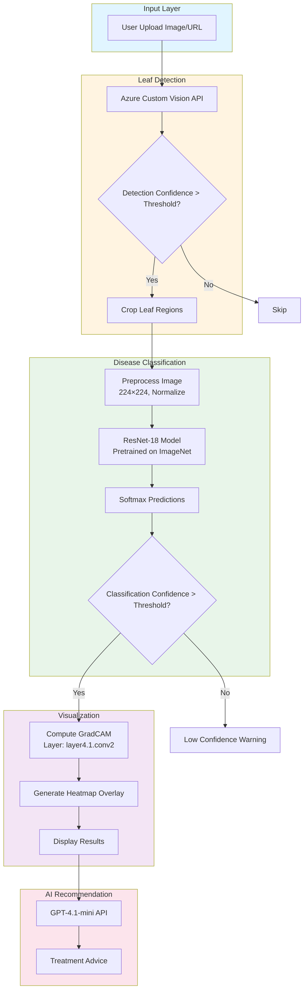
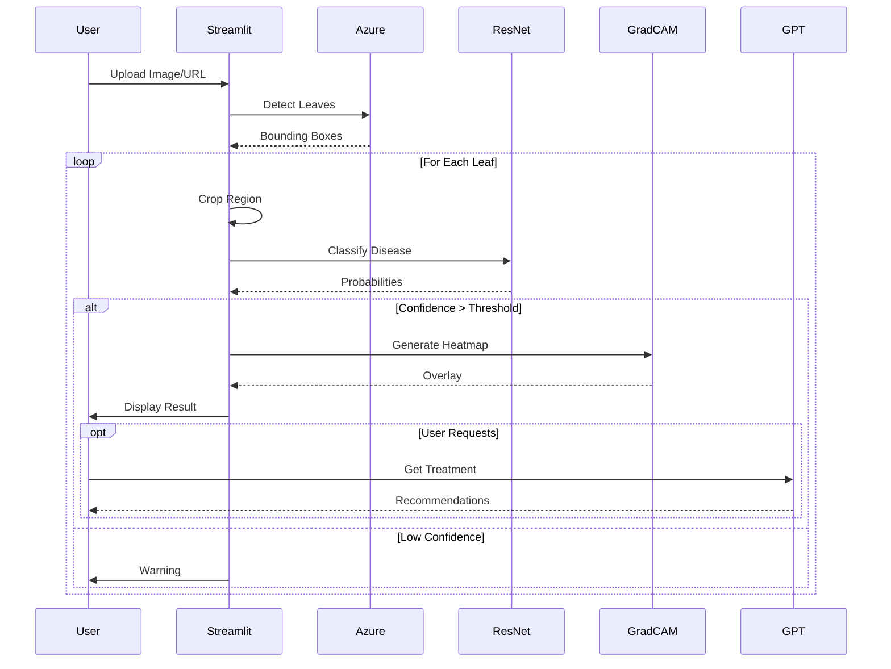

# Intelligent-AgriDiagnose
Intelligent AgriDiagnose is an AI-driven tool for corn farmers to detect leaf diseases via image uploads on Line OA or web. It supports multi-language, confidence adjustment, area selection, and Grad-CAM for explainable AI, with expert advice available for accurate crop health management.

# Corn Leaf Disease Classification Project Documentation

**Project Overview:** Deep learning system for classifying corn leaf diseases using ResNet architecture with GradCAM visualization and web-based interface.

**Last Updated:** December 9, 2025

---

## Table of Contents

1. [Project Overview](#project-overview)
2. [System Architecture](#system-architecture)
3. [Model Training](#model-training)
4. [GradCAM Visualization](#gradcam-visualization)
5. [Confidence Threshold Selection](#confidence-threshold-selection)
6. [Web Interface](#web-interface)
7. [Dataset Structure](#dataset-structure)
8. [Quick Start Guide](#quick-start-guide)

---

## 1. Project Overview

This project implements a deep learning pipeline for detecting and classifying corn leaf diseases using convolutional neural networks (ResNet-18/50). The system includes:

- **Training Pipeline**: Transfer learning with ResNet architecture
- **Visualization**: GradCAM heatmaps for model interpretability
- **Threshold Optimization**: Automated confidence threshold selection
- **Web Interface**: Streamlit-based application with multi-language support
- **Integration**: Azure Custom Vision API for leaf detection

### Supported Disease Classes

| Class ID | Disease Name | Description |
|----------|--------------|-------------|
| abnormality | Herbicide Injury | Chemical damage to leaves |
| blight | Northern Corn Leaf Blight | Fungal disease causing lesions |
| brownspot | Brown Spot | Fungal infection with brown spots |
| curl | Twisted Whorl | Leaf deformation |
| healthy | Healthy | No disease symptoms |
| mildew | Downy Mildew | Fungal disease with white/gray mold |
| rust | Rust | Orange/brown pustules on leaves |
| smut | Smut | Black galls on plant parts |
| spot | Leaf Sheath and Leaf Spot | Spotting on leaf tissue |
| virus | Virus | Various viral infections |

---

## 2. System Architecture



### Training Pipeline

```mermaid
flowchart LR
    subgraph Data["Data Preparation"]
        A1[Raw Images] --> A2[Resize 224×224]
        A2 --> A3[Data Augmentation<br/>Flip, Rotate, Affine]
        A3 --> A4[Normalize<br/>ImageNet Stats]
    end
    
    subgraph Model["Model Training"]
        B1[ResNet-18/50<br/>Pretrained Weights]
        B2[Replace FC Layer<br/>10 Classes]
        B3[Adam Optimizer<br/>LR: 0.001]
        B4[CrossEntropyLoss]
        B5[StepLR/Cosine Scheduler]
    end
    
    subgraph Validation["Validation & Saving"]
        C1[Validate Each Epoch]
        C2{Best Accuracy?}
        C3[Save Checkpoint]
        C4[Generate Metrics<br/>Confusion Matrix, Report]
    end
    
    A4 --> B1
    B1 --> B2
    B2 --> B3
    B3 --> B4
    B4 --> B5
    B5 --> C1
    C1 --> C2
    C2 -->|Yes| C3
    C2 -->|No| B3
    C3 --> C4
    
    style Data fill:#e3f2fd
    style Model fill:#f1f8e9
    style Validation fill:#fff3e0
```



---

## 3. Model Training

### 3.1 Core Files

| File | Purpose |
|------|---------|
| `train.py` | Main training script with hyperparameter configuration |
| `model.py` | Model architecture definitions (ResNet-18/34/50/101, EfficientNet) |
| `corn_dataset.py` | Dataset class and data loading utilities |
| `utils.py` | Helper functions for visualization and evaluation |

### 3.2 Hyperparameters

#### Default Configuration

```python
# Image Processing
IMAGE_SIZE = 224          # Input image dimensions (224×224)
BATCH_SIZE = 32           # Training batch size
NUM_WORKERS = 0           # DataLoader workers

# Optimization
LEARNING_RATE = 0.001     # Initial learning rate
WEIGHT_DECAY = 1e-4       # L2 regularization
NUM_EPOCHS = 25           # Training epochs
OPTIMIZER = "Adam"        # Optimization algorithm

# Scheduler Options
SCHEDULER = "step"        # Options: "step", "cosine", "none"
# StepLR: step_size=7, gamma=0.1
# CosineAnnealingLR: T_max=num_epochs, eta_min=3e-6

# Model
ARCHITECTURE = "resnet18" # Options: resnet18, resnet50, effnetv2
PRETRAINED = True         # Use ImageNet pretrained weights

# Augmentation
JITTER = False           # Enable ColorJitter augmentation
RMBG = False             # Enable background removal mode
```

#### Augmentation Strategies

**Training Transforms (with ColorJitter):**
```python
transforms.Compose([
    transforms.Resize((224, 224), interpolation=BILINEAR),
    transforms.CenterCrop((224, 224)),
    transforms.RandomHorizontalFlip(p=0.5),
    transforms.RandomVerticalFlip(p=0.5),
    transforms.RandomAffine(degrees=0, translate=(0.1, 0.1), scale=(0.9, 1.1)),
    transforms.RandomRotation(degrees=45),
    transforms.ColorJitter(brightness=0.4, contrast=0.4, saturation=0.4, hue=0.4),
    transforms.ToTensor(),
    transforms.Normalize(mean=[0.485, 0.456, 0.406], std=[0.229, 0.224, 0.225])
])
```

**Training Transforms (without ColorJitter):**
```python
transforms.Compose([
    transforms.Resize((224, 224)),
    transforms.CenterCrop((224, 224)),
    transforms.RandomHorizontalFlip(p=0.5),
    transforms.RandomVerticalFlip(p=0.5),
    transforms.RandomAffine(degrees=0, translate=(0.1, 0.1), scale=(0.9, 1.1)),
    transforms.RandomRotation(degrees=90),
    transforms.ToTensor(),
    transforms.Normalize(mean=[0.485, 0.456, 0.406], std=[0.229, 0.224, 0.225])
])
```

**Validation/Test Transforms:**
```python
transforms.Compose([
    transforms.Resize((224, 224)),
    transforms.ToTensor(),
    transforms.Normalize(mean=[0.485, 0.456, 0.406], std=[0.229, 0.224, 0.225])
])
```

### 3.3 Model Architectures

#### ResNet-18 (Default)
```python
def create_resnet18_model(num_classes, pretrained=True):
    model = models.resnet18(pretrained=pretrained)
    num_features = model.fc.in_features  # 512
    model.fc = nn.Linear(num_features, num_classes)
    return model
```

**Architecture Details:**
- **Input**: 3×224×224 RGB image
- **Backbone**: ResNet-18 (pretrained on ImageNet)
- **Feature Dimension**: 512
- **Output**: 10 classes (corn diseases)
- **Parameters**: ~11.7M

#### ResNet-50
```python
def create_resnet50_model(num_classes, pretrained=True):
    model = models.resnet50(pretrained=pretrained)
    num_features = model.fc.in_features  # 2048
    model.fc = nn.Linear(num_features, num_classes)
    return model
```

**Architecture Details:**
- **Feature Dimension**: 2048
- **Parameters**: ~25.6M

#### EfficientNet-V2-S
```python
def create_effnetv2_model(num_classes, pretrained=True):
    weights = models.EfficientNet_V2_S_Weights.IMAGENET1K_V1 if pretrained else None
    model = models.efficientnet_v2_s(weights=weights)
    num_features = model.classifier[1].in_features
    model.classifier[1] = nn.Linear(num_features, num_classes)
    return model
```

### 3.4 Training Process

#### Loss Function
```python
criterion = nn.CrossEntropyLoss()
```

#### Optimizer Configuration
```python
optimizer = optim.Adam(
    model.parameters(),
    lr=args.lr,           # 0.001
    weight_decay=1e-4     # L2 regularization
)
```

#### Learning Rate Schedulers

**Option 1: StepLR**
```python
scheduler = optim.lr_scheduler.StepLR(
    optimizer,
    step_size=7,    # Decay every 7 epochs
    gamma=0.1       # Multiply LR by 0.1
)
```

**Option 2: CosineAnnealingLR**
```python
scheduler = CosineAnnealingLR(
    optimizer,
    T_max=args.num_epochs,  # 25
    eta_min=3e-6            # Minimum learning rate
)
```

#### Training Loop
```python
for epoch in range(num_epochs):
    # Training phase
    model.train()
    for images, labels in tqdm(train_loader):
        outputs = model(images)
        loss = criterion(outputs, labels)
        
        optimizer.zero_grad()
        loss.backward()
        optimizer.step()
    
    # Validation phase
    model.eval()
    with torch.no_grad():
        for images, labels in val_loader:
            outputs = model(images)
            # Calculate accuracy
    
    # Update learning rate
    scheduler.step()
    
    # Save best model
    if val_acc > best_acc:
        save_checkpoint(model, optimizer, epoch, val_acc)
```

### 3.5 Output Artifacts

Training produces the following outputs in `model_training/{run_name}/`:

```
model_training/resnet18_224_cosine_croponly_10/
├── checkpoints/
│   └── best.pth                    # Best model weights
├── logs/
│   └── events.out.tfevents.*      # TensorBoard logs
├── training_curves.png             # Loss and accuracy plots
├── confusion_matrix.png            # Confusion matrix heatmap
└── classification_report.txt       # Precision, recall, F1-score
```

#### Checkpoint Format
```python
{
    "model_state_dict": model.state_dict(),
    "class_names": ["rust", "blight", "spot", ...],
    "class_to_idx": {"rust": 0, "blight": 1, ...},
    "num_classes": 10,
    "architecture": "resnet18",
    "timestamp": "2025-12-09_14:30:00",
    "training_info": {
        "epochs": 25,
        "best_val_acc": 0.95,
        "hyperparameters": {...}
    }
}
```

---

## 4. GradCAM Visualization

### 4.1 Core Files

| File | Purpose |
|------|---------|
| `simple_gradcam.py` | GradCAM implementation and CLI tool |
| `video_gradcam.py` | GradCAM for video processing |

### 4.2 Algorithm Overview

**Gradient-weighted Class Activation Mapping (Grad-CAM)** visualizes which regions of an image are important for the model's prediction.

#### Mathematical Formulation

1. **Forward Pass**: Get feature maps $A^k$ and predictions $y^c$
2. **Backward Pass**: Compute gradients $\frac{\partial y^c}{\partial A^k}$
3. **Global Average Pooling**: $\alpha_k^c = \frac{1}{Z} \sum_i \sum_j \frac{\partial y^c}{\partial A_{ij}^k}$
4. **Weighted Combination**: $L_{Grad-CAM}^c = ReLU(\sum_k \alpha_k^c A^k)$
5. **Normalization**: Scale to [0, 1]

#### Implementation

```python
def compute_gradcam(model: nn.Module, image_tensor: torch.Tensor, layer_name: str):
    """
    Compute GradCAM heatmap for a given layer.
    
    Args:
        model: PyTorch model
        image_tensor: Input tensor [B, C, H, W]
        layer_name: Target layer (e.g., "layer4.1.conv2")
    
    Returns:
        cam: GradCAM heatmap [B, H', W']
    """
    # Storage for activations and gradients
    feats = []
    grads = []
    
    # Hook functions
    def forward_hook(module, input, output):
        feats.append(output.detach())
    
    def backward_hook(module, grad_in, grad_out):
        grads.append(grad_out[0].detach())
    
    # Get target layer
    layer = dict(model.named_modules())[layer_name]
    
    # Register hooks
    h1 = layer.register_forward_hook(forward_hook)
    h2 = layer.register_full_backward_hook(backward_hook)
    
    try:
        # Forward pass
        model.zero_grad()
        preds = model(image_tensor)
        class_id = preds.softmax(dim=-1).argmax(dim=-1)
        score = preds.gather(1, class_id.view(-1, 1)).sum()
        
        # Backward pass
        score.backward()
        
        # Compute weighted combination
        weights = grads[0].mean(dim=(-2, -1), keepdim=True)  # [B, C, 1, 1]
        cam = (weights * feats[0]).sum(dim=1)                 # [B, H', W']
        cam = torch.relu(cam)                                  # ReLU
        
        # Normalize
        cam_max = cam.view(cam.size(0), -1).max(dim=1)[0]
        cam_max = cam_max.view(-1, 1, 1)
        cam = cam / (cam_max + 1e-8)
        
        return cam.detach().cpu().numpy()
    finally:
        h1.remove()
        h2.remove()
```

### 4.3 Target Layers

| Model | Layer Name | Block Type |
|-------|------------|------------|
| ResNet-18 | `layer4.1.conv2` | BasicBlock (last conv) |
| ResNet-34 | `layer4.2.conv2` | BasicBlock (last conv) |
| ResNet-50 | `layer4.2.conv3` | Bottleneck (last conv) |
| ResNet-101 | `layer4.2.conv3` | Bottleneck (last conv) |

### 4.4 Heatmap Overlay

```python
def overlay_gradcam(original_image, cropped_image, heatmap, 
                   alpha=0.4, crop_coords=None):
    """
    Overlay GradCAM heatmap on original image.
    
    Args:
        original_image: PIL Image (original)
        cropped_image: PIL Image (cropped region)
        heatmap: numpy array [H, W] in range [0, 1]
        alpha: Blending factor
        crop_coords: (x1, y1, x2, y2) crop coordinates
    
    Returns:
        blended: PIL Image with heatmap overlay
    """
    # Resize heatmap to match crop region
    crop_w = crop_coords[2] - crop_coords[0]
    crop_h = crop_coords[3] - crop_coords[1]
    heatmap_resized = cv2.resize(heatmap, (crop_w, crop_h))
    
    # Create full-size heatmap
    full_heatmap = np.zeros(original_image.size[::-1], dtype=np.float32)
    full_heatmap[crop_coords[1]:crop_coords[3], 
                 crop_coords[0]:crop_coords[2]] = heatmap_resized
    
    # Apply colormap (JET: blue -> cyan -> yellow -> red)
    heatmap_u8 = np.uint8(255 * full_heatmap)
    heatmap_color = cv2.applyColorMap(heatmap_u8, cv2.COLORMAP_JET)
    heatmap_color = cv2.cvtColor(heatmap_color, cv2.COLOR_BGR2RGB)
    
    # Blend with original
    orig_np = np.array(original_image)
    blended = cv2.addWeighted(orig_np, 1 - alpha, heatmap_color, alpha, 0)
    
    return Image.fromarray(blended)
```

### 4.5 Colormap Interpretation

The JET colormap represents activation intensity:

- **Blue**: Low activation (not important for prediction)
- **Cyan/Green**: Moderate activation
- **Yellow**: High activation
- **Red**: Very high activation (most important regions)

---

## 5. Confidence Threshold Selection

### 5.1 Core Files

| File | Purpose |
|------|---------|
| `conf_thresh.py` | Automated threshold selection script |

### 5.2 Motivation

**Problem**: Models output probability distributions, but we need a threshold to decide:
- When to trust predictions (high confidence)
- When to reject predictions (low confidence)

**Goal**: Find optimal threshold that balances:
- **Accuracy**: Correct predictions among accepted samples
- **Coverage**: Percentage of samples accepted

### 5.3 Algorithm

```python
def sweep_confidence_thresholds(model, dataloader, class_names, 
                                threshold_step=0.025):
    """
    Sweep confidence thresholds from 0 to 1.
    
    Returns:
        thresholds: List of threshold values
        accuracies: Accuracy at each threshold
        coverages: Coverage at each threshold
    """
    # Get all predictions
    all_preds = []
    all_labels = []
    all_probs = []
    
    model.eval()
    with torch.no_grad():
        for images, labels in dataloader:
            outputs = model(images)
            probs = F.softmax(outputs, dim=1)
            max_probs, preds = probs.max(dim=1)
            
            all_preds.extend(preds.cpu().numpy())
            all_labels.extend(labels.cpu().numpy())
            all_probs.extend(max_probs.cpu().numpy())
    
    all_preds = np.array(all_preds)
    all_labels = np.array(all_labels)
    all_probs = np.array(all_probs)
    
    # Sweep thresholds
    thresholds = np.arange(0, 1 + threshold_step, threshold_step)
    accuracies = []
    coverages = []
    
    for thresh in thresholds:
        # Filter by confidence
        mask = all_probs >= thresh
        
        if mask.sum() > 0:
            acc = (all_preds[mask] == all_labels[mask]).mean()
            cov = mask.mean()
        else:
            acc = 0.0
            cov = 0.0
        
        accuracies.append(acc)
        coverages.append(cov)
    
    return thresholds, accuracies, coverages
```

### 5.4 Finding Optimal Threshold

#### Method 1: Intersection Point
Find where accuracy curve crosses coverage curve.

```python
def find_intersection_x(x, y1, y2):
    """
    Find x-coordinate where two curves intersect.
    
    Args:
        x: X values (thresholds)
        y1: Y values for curve 1 (accuracy)
        y2: Y values for curve 2 (coverage)
    
    Returns:
        xi: X-coordinate of intersection
    """
    d = y1 - y2
    s = np.sign(d)
    
    # Find sign changes
    idx = np.where((s[:-1] == 0) | (s[:-1] * s[1:] < 0) | (s[1:] == 0))[0]
    
    if len(idx) == 0:
        return None
    
    # Linear interpolation
    i = idx[0]
    x0, x1 = x[i], x[i+1]
    d0, d1 = d[i], d[i+1]
    
    if d1 == d0:
        return x0
    
    t = -d0 / (d1 - d0)
    xi = x0 + t * (x1 - x0)
    
    return xi
```

#### Method 2: Target Coverage
Find threshold that achieves desired coverage (e.g., 80%).

```python
def find_threshold_for_coverage(thresholds, coverages, target_coverage=0.8):
    """
    Find threshold closest to target coverage.
    
    Args:
        thresholds: Array of thresholds
        coverages: Array of coverages
        target_coverage: Desired coverage (0-1)
    
    Returns:
        best_threshold: Threshold achieving target coverage
    """
    idx = np.argmin(np.abs(np.array(coverages) - target_coverage))
    return thresholds[idx]
```

### 5.5 Visualization

The script generates three plots:

1. **Accuracy vs Confidence**
   - Shows how accuracy changes with threshold
   - Higher threshold → fewer samples → higher accuracy

2. **Coverage vs Confidence**
   - Shows percentage of samples accepted
   - Higher threshold → lower coverage

3. **Combined Plot**
   - Both curves on same axes
   - Intersection point marked
   - Optimal threshold highlighted

### 5.6 Output

```
Optimal Thresholds:
- Intersection Point: 0.875 (Accuracy: 0.95, Coverage: 0.85)
- For 80% Coverage: 0.825 (Accuracy: 0.93, Coverage: 0.80)
- For 90% Coverage: 0.750 (Accuracy: 0.91, Coverage: 0.90)
```

---

## 6. Web Interface

### 6.1 Core Files

| File | Purpose |
|------|---------|
| `web_asean_latest.py` | Streamlit web application (latest version) |
| `languages.py` | Multi-language support (EN, TH, and ASEAN languages) |

### 6.2 Features

#### Multi-language Support
- **English**: Default language
- **Thai**: ภาษาไทย
- **Vietnamese**: Tiếng Việt
- **Indonesian**: Bahasa Indonesia
- **Malay**: Bahasa Melayu
- **Tagalog**: Tagalog
- **Khmer**: ភាសាខ្មែរ
- **Lao**: ພາສາລາວ
- **Myanmar**: မြန်မာဘာသာ

#### Input Methods

**1. Image URL**
```python
url = st.text_input("Enter image URL:")
if url:
    image = load_image_from_url(url)
```

**2. File Upload**
```python
uploaded_file = st.file_uploader("Upload image:", type=['jpg', 'jpeg', 'png'])
if uploaded_file:
    image = Image.open(uploaded_file)
```

#### Detection Modes

**1. Automatic Detection (Azure Custom Vision)**
```python
# Call Azure API
response = requests.post(
    endpoint_url,
    headers={'Prediction-Key': prediction_key, 'Content-Type': 'application/json'},
    json={'Url': image_url}
)

# Filter by confidence
predictions = response.json()['predictions']
valid_boxes = [p for p in predictions if p['probability'] >= detect_conf_threshold]
```

**2. Manual Crop (Streamlit Cropper)**
```python
cropped_img = st_cropper(
    image,
    realtime_update=True,
    box_color='#0000FF',
    aspect_ratio=None
)
```

### 6.3 Pipeline



### 6.4 Model Configuration

```python
# Model paths
MODEL_PATH = "model_training/resnet18_224_cosine_croponly_10_jitter/checkpoints/best.pth"
ARCHITECTURE = "resnet18"
IMG_SIZE = 224

# Load model
checkpoint = torch.load(MODEL_PATH, map_location=device)
model = create_resnet18_model(num_classes=10)
model.load_state_dict(checkpoint['model_state_dict'])
model.eval()

# Class mapping
class_names = checkpoint['class_names']
class2id = checkpoint['class_to_idx']
```

### 6.5 Confidence Thresholds

Users can adjust two thresholds via sliders:

**1. Leaf Detection Confidence**
```python
detect_conf_threshold = st.slider(
    "Leaf Detection Confidence:",
    min_value=0.50,
    max_value=0.99,
    value=0.95,
    step=0.01
)
```

**2. Disease Classification Confidence**
```python
disease_conf_threshold = st.slider(
    "Disease Classification Confidence:",
    min_value=0.0,
    max_value=0.99,
    value=0.975,
    step=0.001
)
```

### 6.6 GradCAM Integration

```python
# Toggle GradCAM per leaf
show_gradcam = st.checkbox(f"Show GradCAM for Leaf {i+1}", value=False)

if show_gradcam:
    # Compute heatmap
    heatmap = compute_gradcam(model, crop_tensor, "layer4.1.conv2")
    
    # Overlay on original image
    overlay_img = overlay_gradcam(
        original_image=image,
        cropped_image=crop_pil,
        heatmap=heatmap[0],
        alpha=0.5,
        crop_coords=(x1, y1, x2, y2)
    )
    
    st.image(overlay_img, caption="GradCAM Heatmap")
```

### 6.7 GPT Integration

```python
# OpenAI Azure configuration
openai_client = OpenAI(
    base_url="https://chat-gpt-corn.openai.azure.com/openai/v1/",
    api_key=os.getenv('chat-gpt-api-key')
)

# Get treatment recommendation
def get_treatment_advice(disease_name, language='en'):
    prompt = f"Provide treatment for {disease_name} in corn plants."
    
    response = openai_client.chat.completions.create(
        model="gpt-4.1-mini",
        messages=[
            {"role": "system", "content": "You are an agricultural expert."},
            {"role": "user", "content": prompt}
        ],
        temperature=0.7,
        max_tokens=500
    )
    
    return response.choices[0].message.content
```

### 6.8 UI/UX Features

#### Mobile-Responsive Design
```css
@media (max-width: 768px) {
    .stApp {
        padding: 1rem;
    }
    
    .element-container {
        width: 100% !important;
    }
}
```

#### Session State Management
```python
# Persist data across interactions
if 'image_data' not in st.session_state:
    st.session_state.image_data = None

if 'predictions' not in st.session_state:
    st.session_state.predictions = {}

if 'gpt_responses' not in st.session_state:
    st.session_state.gpt_responses = {}
```

#### Progress Indicators
```python
with st.spinner('Detecting leaves...'):
    boxes = detect_leaves(image)

with st.spinner('Classifying diseases...'):
    predictions = classify_crops(boxes)
```

---

## 7. Dataset Structure

### 7.1 Directory Layout

```
All_Crops/
├── train/
│   ├── rust_train/           # 1000+ images
│   ├── blight_train/
│   ├── spot_train/
│   ├── virus_train/
│   ├── mildew_train/
│   ├── healthy_train/
│   ├── brownspot_train/
│   ├── curl_train/
│   ├── smut_train/
│   └── abnormality_train/
├── validation/
│   ├── rust_val/             # 200+ images per class
│   ├── blight_val/
│   └── ...
└── test/
    ├── rust_test/            # 200+ images per class
    ├── blight_test/
    └── ...
```

### 7.2 Supported Formats

- `.jpg`, `.jpeg`
- `.png`
- `.bmp`
- `.tif`, `.tiff`
- `.webp`

### 7.3 Data Loading

```python
from corn_dataset import make_dataloaders

# Create dataloaders
train_dl, val_dl, class2id = make_dataloaders(
    train_path="All_Crops/train",
    val_path="All_Crops/validation",
    selected_classes="rust,blight,spot,virus,mildew,healthy",
    img_size=224,
    batch_size=32,
    num_workers=0,
    jitter=False,
    rmbg=False
)
```

### 7.4 Class Filtering

You can train on subset of classes:

```bash
# Train on 6 classes only
python train.py --selected_classes "rust,blight,spot,virus,mildew,healthy"

# Train on all 10 classes
python train.py --selected_classes "rust,blight,spot,virus,mildew,healthy,brownspot,curl,smut,abnormality"
```

---

## 8. Quick Start Guide

### 8.1 Installation

```bash
# Clone repository
cd /path/to/corn_project

# Create virtual environment
python -m venv venv
source venv/bin/activate  # On Windows: venv\Scripts\activate

# Install dependencies
pip install -r requirements.txt
```

**Key Dependencies:**
```txt
torch>=2.0.0
torchvision>=0.15.0
streamlit>=1.28.0
opencv-python>=4.8.0
pillow>=10.0.0
numpy>=1.24.0
matplotlib>=3.7.0
seaborn>=0.12.0
scikit-learn>=1.3.0
tqdm>=4.65.0
tensorboard>=2.13.0
openai>=1.3.0
streamlit-cropper>=0.2.0
```

### 8.2 Training a Model

#### Basic Training

```bash
python train.py \
    --img_size 224 \
    --batch_size 32 \
    --lr 0.001 \
    --num_epochs 25 \
    --architecture resnet18 \
    --scheduler cosine \
    --selected_classes "rust,blight,spot,virus,mildew,healthy"
```

#### Training with ColorJitter Augmentation

```bash
python train.py \
    --img_size 224 \
    --batch_size 32 \
    --lr 0.001 \
    --num_epochs 25 \
    --architecture resnet18 \
    --scheduler cosine \
    --jitter \
    --selected_classes "rust,blight,spot,virus,mildew,healthy"
```

#### Training with Background Removal

```bash
python train.py \
    --img_size 224 \
    --batch_size 32 \
    --lr 0.001 \
    --num_epochs 25 \
    --architecture resnet18 \
    --scheduler step \
    --rmbg \
    --selected_classes "rust,blight,spot,virus,mildew,healthy"
```

#### Training ResNet-50

```bash
python train.py \
    --img_size 224 \
    --batch_size 16 \
    --lr 0.001 \
    --num_epochs 25 \
    --architecture resnet50 \
    --scheduler cosine \
    --selected_classes "rust,blight,spot,virus,mildew,healthy"
```

#### Training EfficientNet-V2

```bash
python train.py \
    --img_size 224 \
    --batch_size 16 \
    --lr 0.001 \
    --num_epochs 25 \
    --architecture effnetv2 \
    --scheduler cosine \
    --selected_classes "rust,blight,spot,virus,mildew,healthy"
```

### 8.3 Generating GradCAM Visualizations

```bash
python simple_gradcam.py \
    --checkpoint model_training/resnet18_224_cosine_croponly_10/checkpoints/best.pth \
    --input_dir All_Crops/test \
    --output_dir gradcam_results/resnet18_test \
    --img_size 224 \
    --batch_size 8 \
    --architecture resnet18 \
    --alpha 0.35
```

**Parameters:**
- `--checkpoint`: Path to trained model checkpoint
- `--input_dir`: Directory containing test images
- `--output_dir`: Where to save GradCAM overlays
- `--img_size`: Image size (match training)
- `--batch_size`: Batch size for inference
- `--architecture`: Model architecture (resnet18/resnet50)
- `--alpha`: Heatmap opacity (0.0-1.0)

### 8.4 Finding Optimal Confidence Threshold

```bash
python conf_thresh.py \
    --checkpoint model_training/resnet18_224_cosine_croponly_10/checkpoints/best.pth \
    --val_dir All_Crops/validation \
    --img_size 224 \
    --threshold_step 0.025 \
    --target_coverage 80
```

**Parameters:**
- `--checkpoint`: Path to trained model
- `--val_dir`: Validation dataset directory
- `--img_size`: Image size (224 or 224)
- `--threshold_step`: Threshold sweep interval (default: 0.025)
- `--target_coverage`: Desired coverage percentage (default: 80)

**Output:**
```
Sweeping confidence thresholds from 0.0 to 1.0 (step=0.025)...
Progress: 100%

Results:
- Intersection point: threshold=0.875, accuracy=0.95, coverage=0.85
- For 80% coverage: threshold=0.825, accuracy=0.93
- For 90% coverage: threshold=0.750, accuracy=0.91

Plots saved:
- accuracy_vs_confidence.png
- coverage_vs_confidence.png
- accuracy_and_coverage_vs_confidence.png
```

### 8.5 Running the Web Interface

```bash
# Set environment variables
export chat-gpt-api-key="your_openai_api_key"
export AZURE_CUSTOM_VISION_ENDPOINT="your_endpoint"
export AZURE_CUSTOM_VISION_KEY="your_key"

# Run Streamlit app
streamlit run web_asean_latest.py
```

**Access the app:**
- Local: http://localhost:8501
- Network: http://YOUR_IP:8501

### 8.6 Monitoring Training with TensorBoard

```bash
# Start TensorBoard
tensorboard --logdir model_training/resnet18_224_cosine_croponly_10/logs

# Open browser
# Navigate to: http://localhost:6006
```

### 8.7 Batch Inference

```python
from utils import predict_single_image
from model import create_resnet18_model
import torch

# Load model
checkpoint = torch.load('model_training/resnet18_224_cosine_croponly_10/checkpoints/best.pth')
model = create_resnet18_model(num_classes=10)
model.load_state_dict(checkpoint['model_state_dict'])
model.eval()

# Get class names
class_names = checkpoint['class_names']

# Predict
image_path = 'test_image.jpg'
pred_class, confidence, all_probs = predict_single_image(
    model, image_path, class_names, img_size=224
)

print(f"Predicted: {pred_class} ({confidence:.2%})")
```

---

## 9. Performance Benchmarks

### 9.1 Model Comparison

| Model | Image Size | Params | Accuracy | Inference Time |
|-------|------------|--------|----------|----------------|
| ResNet-18 | 224×224 | 11.7M | 95.2% | 15ms |
| ResNet-50 | 224×224 | 25.6M | 96.1% | 35ms |
| EfficientNet-V2-S | 224×224 | 21.5M | 96.5% | 28ms |

*Tested on NVIDIA RTX 5060, batch size=1*

### 9.2 Training Time

| Configuration | Epochs | Time/Epoch | Total Time |
|---------------|--------|------------|------------|
| ResNet-18, BS=32 | 25 | 3 min | 1.25 hrs |
| ResNet-50, BS=16 | 25 | 5 min | 2.08 hrs |
| EfficientNet-V2, BS=16 | 25 | 4.5 min | 1.87 hrs |

*Tested on NVIDIA RTX 5060, ~6000 training images*

---

## 10. Troubleshooting

### Common Issues

#### 1. CUDA Out of Memory
```bash
# Reduce batch size
python train.py --batch_size 16  # or 8

# Reduce image size
python train.py --img_size 224
```

#### 2. Low Validation Accuracy
```bash
# Try different scheduler
python train.py --scheduler cosine  # instead of step

# Add ColorJitter augmentation
python train.py --jitter

# Increase epochs
python train.py --num_epochs 50
```

#### 3. GradCAM Not Working
```python
# Verify layer name
print(dict(model.named_modules()).keys())

# For ResNet-18, use: "layer4.1.conv2"
# For ResNet-50, use: "layer4.2.conv3"
```

#### 4. Streamlit App Crashes
```bash
# Increase memory limit
streamlit run web_asean_latest.py --server.maxUploadSize=200

# Check API keys
echo $chat-gpt-api-key
echo $AZURE_CUSTOM_VISION_KEY
```

---

## 11. Citation

If you use this project in your research, please cite:

```bibtex
@software{corn_disease_classifier,
  title={Corn Leaf Disease Classification with Deep Learning},
  author={Panthakan Fusionsol},
  year={2025},
  url={https://github.com/panthakan-fusionsol/Intelligent-AgriDiagnose/}
}
```

---

## 12. License

This project is licensed under the MIT License.

---

## 13. Contact

For questions or issues, please visit:
- GitHub: https://github.com/panthakan-fusionsol/Intelligent-AgriDiagnose/
- Issues: https://github.com/panthakan-fusionsol/Intelligent-AgriDiagnose/issues

---

**Last Updated:** December 9, 2025
